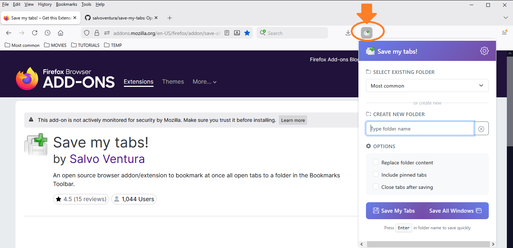
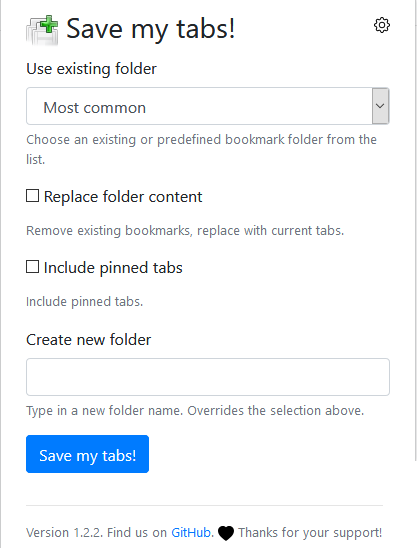
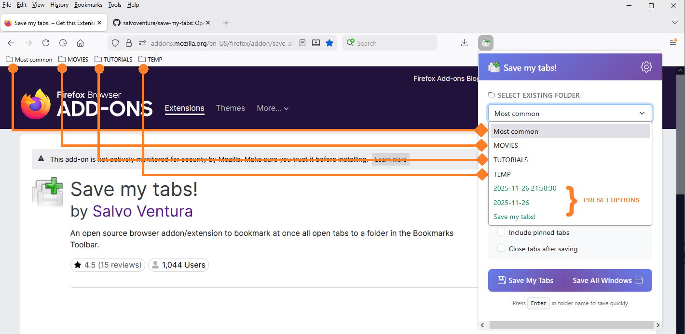
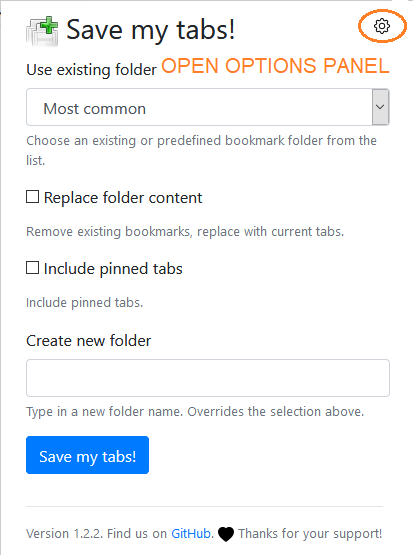

# Save my tabs!

An open source browser addon/extension to bookmark at once all open tabs to a folder in the Bookmarks Toolbar. Features include auto-save, multi-window support, flexible bookmark locations, and automatic cleanup of old saves.

## Why this tool

I wanted a simple and easy way to dump lots of open tabs to a folder, so that I can reopen them all at a later time.

## Background

Anyone doing online research ends up eventually with a lot of content open across multiple tabs. As it usually happens, many of these tabs are kept open just as a placeholder for review, which may not happen right away. If you cannot keep your browser open forever, or if you have multiple research projects going on at the same time, it can be convenient to just dump the current tabs on a bookmark folder, which makes it easy to resume the research activity at a later time. In fact, you can use the *Open All in Tabs* option on the folder to reopen all tabs.

## Installation

### Mozilla Firefox
https://addons.mozilla.org/addon/save-all-my-tabs/

### Google Chrome
https://chrome.google.com/webstore/detail/save-my-tabs/kfoppgabigkfegjfafmadikhjllohfep

### Microsoft Edge
You would use the Google Chrome store.

https://support.microsoft.com/en-us/help/4538971/microsoft-edge-add-or-remove-extensions

## Usage

Once installed, a new icon button will appear in the browser toolbar. The tooltip displays **Save my tabs!**. Click on the button, and a popup will open. Here you will be given the option to select an existing bookmark folder, create a new folder from a suggested preset name (in green), or use a custom folder name by typing it in the edit box. Then simply press the *Save my tabs* button and once the popup closes, the job is done!





> **Note:** Input in the **Create new folder** box will have precedence over any selected value.

### Keyboard Shortcut

You can configure a keyboard shortcut to quickly open the Save my Tabs popup:

**Chrome / Edge / Brave:**
- Navigate to `chrome://extensions/shortcuts` (Chrome) or `edge://extensions/shortcuts` (Edge)
- Find "Save my tabs!" and configure your preferred shortcut (e.g., `Ctrl+Shift+S`)

**Firefox:**
- The default shortcut `Ctrl+Shift+S` (`Command+Shift+S` on Mac) is usually active by default
- To customize: Go to `about:addons` → Click the gear icon → Manage Extension Shortcuts

### Quick Save Feature

When typing in the "Create new folder" input box, you can press **Enter** to immediately save your tabs without clicking the button. This provides a fast workflow for power users.

### Predefined bookmark folders

This list is taken from the browser default Bookmarks Toolbar, in the same order shown. If you would like to customize the order of this list, just rearrange the order of the folders on the Bookmarks Toolbar.

#### Last Used Folder

The extension remembers your last used folder and automatically selects it in the dropdown when you open the popup. This feature can be disabled in the Options panel if you prefer to always start with no selection.

#### Preset names

The preset names options will show up last and in green in the select list. You will notice that these are date-specific, which I thought would be a useful shortcut for grouping tabs in a chronological manner.



## Save Options

### Replace folder content

By default, tabs will be *added* to existing folders; duplicates are detected based on URL. If you wish to instead completely *replace* the content of an existing bookmarks folder with the new list, check this box. Use with care.

### Include pinned tabs

By default, pinned tabs are excluded from saves (since they're meant to stay open). Check this option to include them in your bookmarks.

### Close tabs after saving

Optionally close all saved tabs after bookmarking them. This helps keep your browser clean. You can also control whether pinned tabs are closed in the Options panel.

## Save All Windows

In addition to saving tabs from the current window, you can save tabs from **all open browser windows** at once using the "Save All Windows" button (right button in the popup).

When using this feature:
- Each window's tabs are saved into separate subfolders
- Subfolders are named using the window name (if set) or Window[ID]
- All subfolders are created under your selected parent folder

**Example structure:**
```
MyProject/
├── Window[123]/
│   ├── Tab 1
│   ├── Tab 2
│   └── Tab 3
└── Window[124]/
    ├── Tab 4
    └── Tab 5
```

## Options Panel

On the top right corner of the Save my Tabs popup, you will find a gear icon: click on it and the *Options* panel will open.



### Auto-save Settings

The auto-save feature automatically bookmarks all open tabs **across all browser windows** at regular intervals.

**Enable/Disable**  
Toggle automatic tab saving on or off

**Interval**  
Set how frequently tabs are saved (1-60 minutes)

**Overwrite**  
When enabled, only the most recent tabs are kept (replaces existing bookmarks)  
When disabled, new tabs are appended to existing bookmarks

**Save pinned tabs**  
Choose whether to include pinned tabs in auto-save snapshots

**Auto-save Bookmark Location**  
Choose where auto-save folders are created:
- Default (Bookmarks Toolbar/Bar)
- Bookmarks Toolbar/Bar
- Other Bookmarks
- Bookmarks Menu (Firefox only)
- Custom Folder (select any bookmark folder)


**Auto-save Retention**  
Automatically delete auto-save folders older than a specified number of days (1-366)  
This helps prevent bookmark clutter from accumulating over time

Auto-saved bookmarks are organized in a hierarchical structure:
```
AUTOSAVE/
├── 2024-11-22/
│   ├── Window[123]/
│   │   ├── Tab 1
│   │   └── Tab 2
│   └── Window[124]/
│       └── Tab 3
└── 2024-11-23/
    └── Window[123]/
        └── Tab 4
```


### Other Settings

**Close tabs after saving**  
Set the default state for the "Close tabs after saving" checkbox in the popup  
Also control whether pinned tabs are closed along with regular tabs

**Bookmark Location**  
Choose where manual saves are stored (separate from auto-save location):
- Default (Bookmarks Toolbar/Bar) - Original behavior
- Bookmarks Toolbar/Bar
- Other Bookmarks
- Bookmarks Menu (Firefox only)
- Custom Folder (select any bookmark folder)

**Remember last used folder**  
When enabled, the popup automatically selects the last folder you used  
Disable this if you prefer to manually select a folder each time

**Folder Name Prefix**  
Automatically add a prefix to your folder names:
- **Custom text:** Your own prefix (e.g., "Project_")
- **Current date:** Adds date in YYYY-MM-DD format
- **Date and time:** Adds YYYY-MM-DD HH:MM
- **Window name:** Uses the browser window's name or Window[ID]

The prefix appears in the folder name input and can be edited before saving

### Statistics

Track your usage in the About tab:
- Total saves (manual + auto-save)
- Total tabs saved
- Auto-save count
- Folders created
- Last save timestamp
- Extension install date

Statistics can be reset at any time.

## Version History

### 2.0.1 
- Bugfix for #21 Auto-save broken in v2.0.0

### 2.0.0 (Manifest V3)
- Complete rewrite for Manifest V3 compatibility
- Migrated to ES6 modules with modern architecture
- Added "Save All Windows" feature with per-window organization
- Added custom folder selection for both manual and auto-save
- Added folder name prefix options (date, time, window name, custom)
- Added "Remember last folder" feature
- Added "Close tabs after saving" option with pinned tab control
- Added auto-save retention/cleanup feature
- Separate bookmark locations for manual saves and auto-saves
- Enhanced auto-save with per-window subfolder organization
- Added usage statistics tracking
- Improved keyboard shortcut support (Enter key in folder input)
- Modern UI with Bootstrap 5
- Enhanced error handling and logging
- Build system with Makefile for Chrome/Firefox packages

### 1.2.3
- Bugfix to prevent autosave from losing all bookmarks for the day after a browser crash

### 1.2.2
- Allow user to control what happens to pinned tabs

### 1.2.1
- Skipping pinned tabs from being saved: being pinned, the browser will keep them around already
- Update info texts, including the fact that Microsoft Edge is now supported as well: just use the Google Chrome store to install the extension

### 1.2.0
- Partially address enhancement #1 [Option to set autosave and autodelete old saves.](https://github.com/salvoventura/save-my-tabs/issues/1)
- Upgrade Bootstrap CSS library to v4.4.1
- Upgrade webextension-polyfill to v0.6.0
- Manifest updates to include additional permissions (alarms, storage), background scripts, and options_ui
- UI cosmetic and usability enhancements

### 1.1.0
- Implement enhancement #2 [Selected an existing folder to save bookmarks into will delete all the preexisting bookmarks in that folder](https://github.com/salvoventura/save-my-tabs/issues/2)
- Fix issue #4 [Misdetects duplicate tabs](https://github.com/salvoventura/save-my-tabs/issues/4)

### 1.0.1
- First release

## License

**Save my tabs** is released under the [MIT License](http://www.opensource.org/licenses/MIT).  
The source code is available on GitHub at https://github.com/salvoventura/save-my-tabs

## Credits

- Icon file (iconfinder_tab_new_raised_18931.png) 
  - **Alessandro Rei**, License GPL, *Dark Glass* icon set, https://www.iconfinder.com/icons/6203/new_raised_tab_icon
- Other icons are from Bootstrap Icons
- Bootstrap 5 CSS framework
- WebExtension Browser API Polyfill
