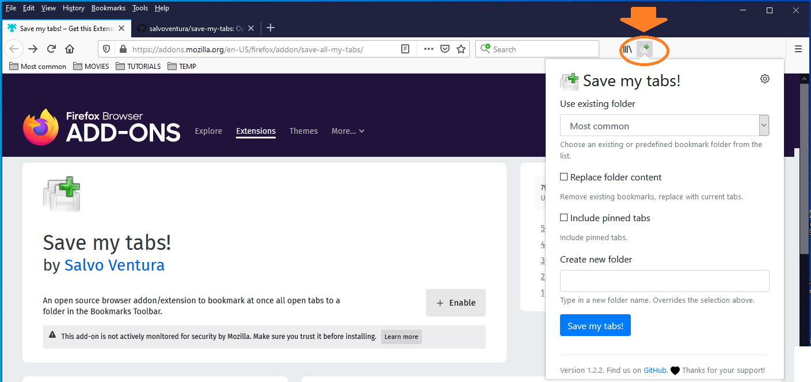
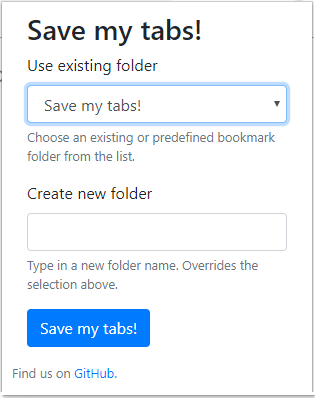
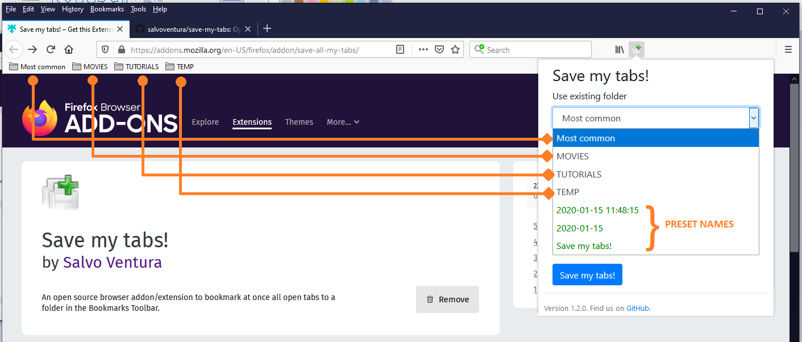
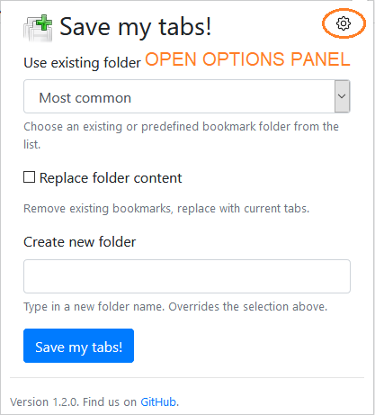

#############
Save my tabs!
#############
An open source browser addon/extension to bookmark at once all open tabs to a folder in the Bookmarks Toolbar. Now it includes an auto-save feature.  

Why this tool
=============
I wanted a simple and easy way to dump lots of open tabs to a folder, so that I can reopen them all at a later time.

Background
==========
Anyone doing online research ends up eventually with a lot of content open across multiple tabs. As it usually happens, many of these tabs are kept open just as a placeholder for review, which may not happen right away. If you cannot keep your browser open forever, or if you have multiple research projects going on at the same time, it can be convenient to just dump the current tabs on a bookmark folder, which makes it easy to resume the research activity at a later time. In fact, you can use the *Open All in Tabs* option on the folder to reopen all tabs.

############
Installation
############

Mozilla Firefox
===============
`<https://addons.mozilla.org/addon/save-all-my-tabs/>`_

Google Chrome
=============
`<https://chrome.google.com/webstore/detail/save-my-tabs/kfoppgabigkfegjfafmadikhjllohfep>`_

Microsoft Edge
==============
You would use the Google Chrome store.

`<https://support.microsoft.com/en-us/help/4538971/microsoft-edge-add-or-remove-extensions>`_

#####
USAGE
#####
Once installed, a new icon button will appear in the browser toolbar. The tooltip displays **Save my tabs!**. Click on the button, and a popup will open. Here you will be given the option to select an existing bookmark folder, create a new folder from a suggested preset name (in green), or use a custom folder name by typing it in the edit box. Then simply press the *Save my tabs* button and once the popup closes, the job is done!

.. note:: Input in the **Create new folder** box will have precedence over any selected value.

Predefined bookmark folders
===========================
This list is taken from the browser default Bookmarks Toolbar, in the same order shown. If you would like to customize the order of this list, just rearrange the order of the folders on the Bookmarks Toolbar.

Preset names
------------
The preset names options will show up last and in green in the select list. You will notice that these are date-specific, which I thought would be a useful shortcut for grouping tabs in a chronological manner.

Replace folder content
======================
By default, tabs will be *added* to existing folders; duplicates are detected based on URL. If you wish to instead completely *replace* the content of an existing bookmarks folder with the new list, check this box. Use with care.

Options (Autosave)
==================
On the top right corner of the Save my Tabs popup, you will find a gear icon: click on it and the *Options* panel will open. Currently, the only options available are to control the **autosave** feature. 

Options are described in detail on the panel. Essentially, you can specify a time interval at which the addon will bookmark all the open tabs **across all browser windows** into a daily folder. These folders are created under a bookmark folder called AUTOSAVE.

.. image:: options-panel-snapshot.png

###########
Development
###########
This is my first take at browser addon development, and while it is a very simple one, I learned a lot in the process, not without frustrations. You are welcome to use it as a base for your suggestions and enhancement, which I would love to incorporate as they come.

Installation
============
To install during development, please follow these excellent tutorials, one for `Chrome <https://developer.chrome.com/extensions/getstarted>`_, and one for `Mozilla Firefox <https://developer.mozilla.org/en-US/docs/Mozilla/Add-ons/WebExtensions>`_. 

Version history
===============
- 1.2.1
   - Skipping pinned tabs from being saved: being pinned, the browser will keep them around already
   - Update info texts, including the fact that Microsoft Edge is now supported as well: just use the Google Chrome store to install the extension

- 1.2.0
   - Partially address enhancement #1 `Option to set autosave and autodelete old saves. <https://github.com/salvoventura/save-my-tabs/issues/1>`_
   - Upgrade Bootstrap CSS library to v4.4.1
   - Upgrade webextension-polyfill to v0.6.0
   - Manifest updates to include additional permissions (alarms, storage), background scripts, and options_ui
   - UI cosmetic and usability enhancements

- 1.1.0
   - Implement enhancement #2 `Selected an existing folder to save bookmarks into will delete all the preexisting bookmarks in that folder <https://github.com/salvoventura/save-my-tabs/issues/2>`_
   - Fix issue #4 `Misdetects duplicate tabs <https://github.com/salvoventura/save-my-tabs/issues/4>`_

- 1.0.1
   - First release

#######
License
#######
**Save my tabs** is released under the `MIT License <http://www.opensource.org/licenses/MIT>`_.
The source code is available on GitHub at `https://github.com/salvoventura/save-my-tabs <https://github.com/salvoventura/save-my-tabs>`_.

Other credits
=============
 - Icon file (iconfinder_tab_new_raised_18931.png) 
   - **Alessandro Rei**, License GPL, *Dark Glass* icon set, https://www.iconfinder.com/icons/6203/new_raised_tab_icon
